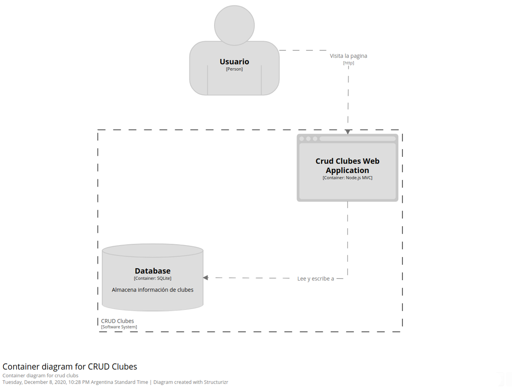
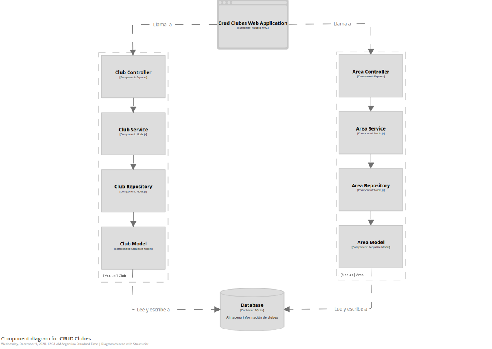

# Crud Clubes

## Overview 
ABM/CRUD de clubes

## Correr el proyecto localmente
1. Clonar el proyecto localmente.
2. Copiar lo que esta adentro de .env.dist y pegarlo en un nuevo archivo llamado .env
3. Correr `npm install`. 
4. Correr `npm run dev`. 
5. Abrir [http://localhost:8080](http://localhost:8080) para verlo en el navegador.

## Dependencias
- [Bulma](https://bulma.io/)
- [Express](http://expressjs.com/)
- [Express-handlebars](https://www.npmjs.com/package/express-handlebars)
- [Multer](https://www.npmjs.com/package/multer)
- [connect-session-sequelize](https://www.npmjs.com/package/connect-session-sequelize)
- [dotenv](https://www.npmjs.com/package/dotenv)
- [express-session](https://www.npmjs.com/package/express-session)
- [rsdi](https://www.npmjs.com/package/rsdi)
- [sequelize](https://sequelize.org/)
- [sqlite3](https://www.npmjs.com/package/sqlite3)

## Dependencias de desarrollo 
- [Eslint](https://eslint.org/)
- [Eslint-config-airbnb-base](https://www.npmjs.com/package/eslint-config-airbnb-base)
- [Eslint-plugin-import](https://www.npmjs.com/package/eslint-plugin-import)
- [Nodemon](https://www.npmjs.com/package/nodemon)
- [@types/jest](https://www.npmjs.com/package/@types/jest)
- [jest](https://jestjs.io/docs/en/getting-started)
- [jsdoc](https://jsdoc.app/)

## Creando modelos nuevos
Cuando se crea un modelo nuevo de sequelize, agregarlo en el archivo src/cli/init.db.js para que la sincronización de la base de datos incluya el nuevo modelo.

## Diagramas

