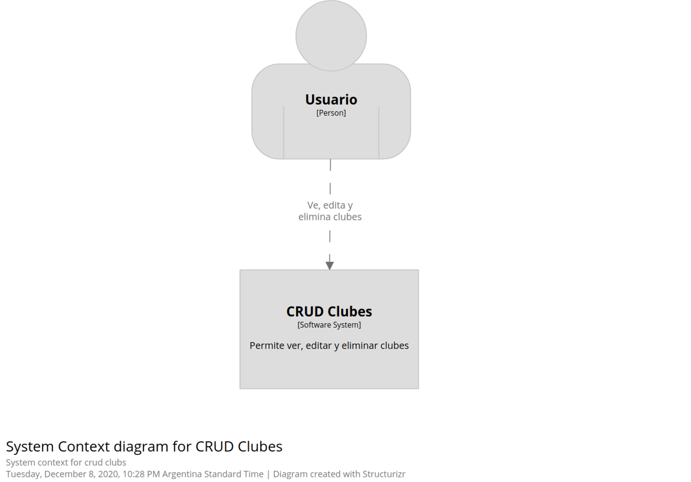
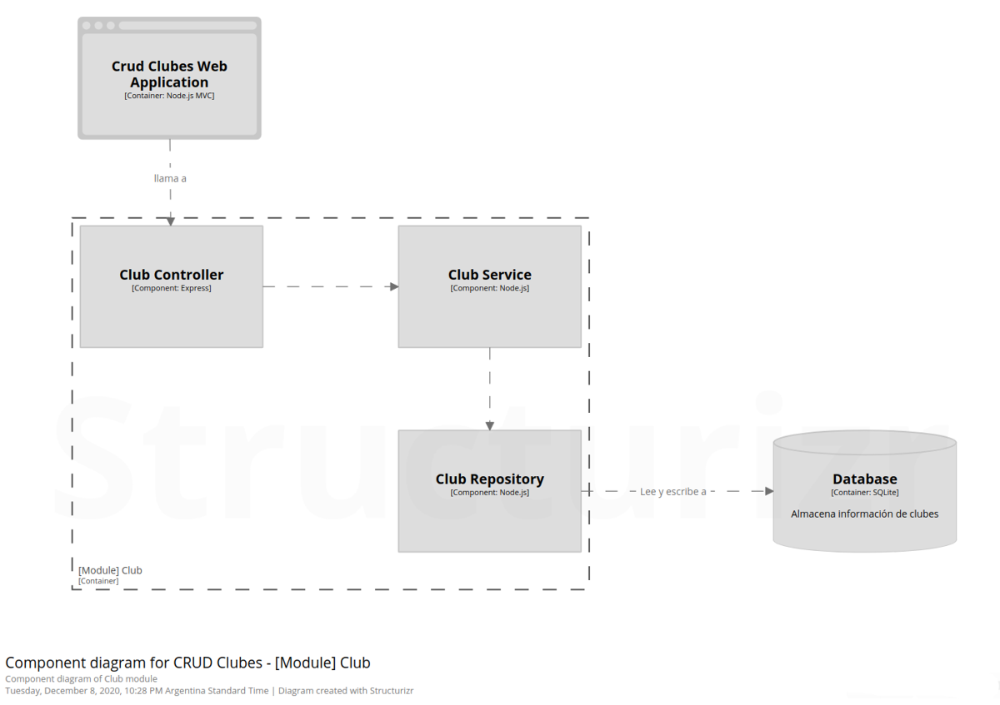

# Crud Clubes

## Overview 
ABM/CRUD de clubes

## Diagramas

## Live Demo : 

## Running the project locally
1. Clone this project locally.
2. Run `npm install`. 
3. Run `npm dev`. 
Open [http://localhost:8080](http://localhost:8080) to view it in the browser. 
The page will reload if you make edits.

## Dependencies
- [Bulma](https://bulma.io/)
- [Express](http://expressjs.com/)
- [Express-handlebars](https://www.npmjs.com/package/express-handlebars)
- [Multer](https://www.npmjs.com/package/multer)

## Dev dependecies 
- [Eslint](https://eslint.org/)
- [Eslint-config-airbnb-base](https://www.npmjs.com/package/eslint-config-airbnb-base)
- [Eslint-plugin-import](https://www.npmjs.com/package/eslint-plugin-import)
- [Nodemon](https://www.npmjs.com/package/nodemon)
